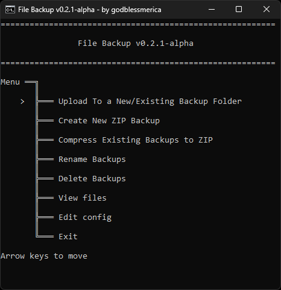
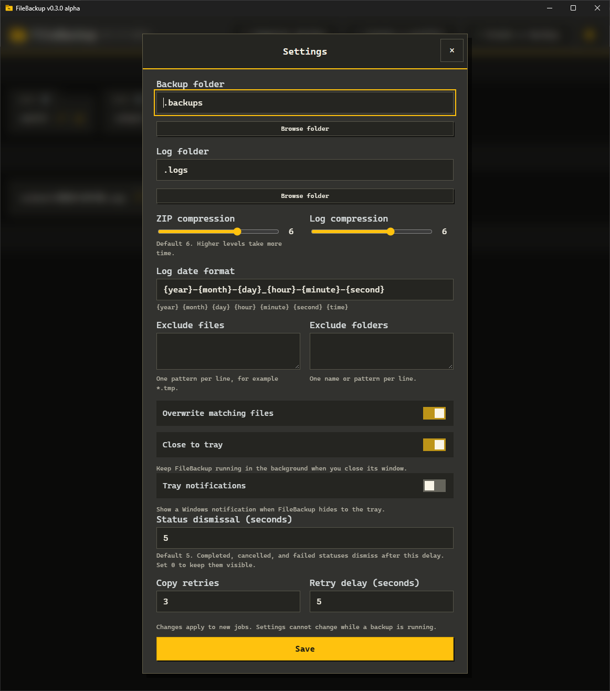
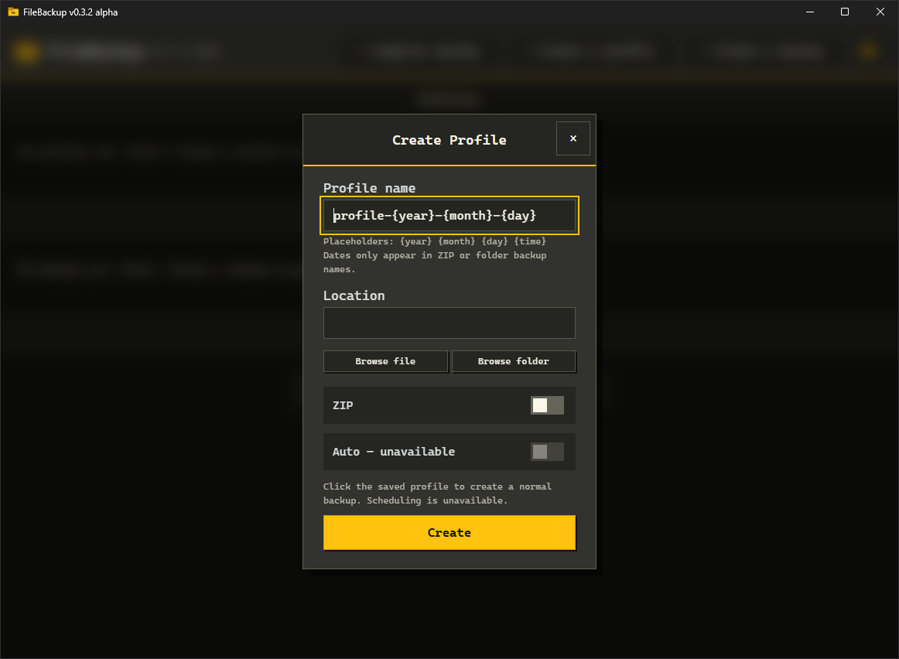
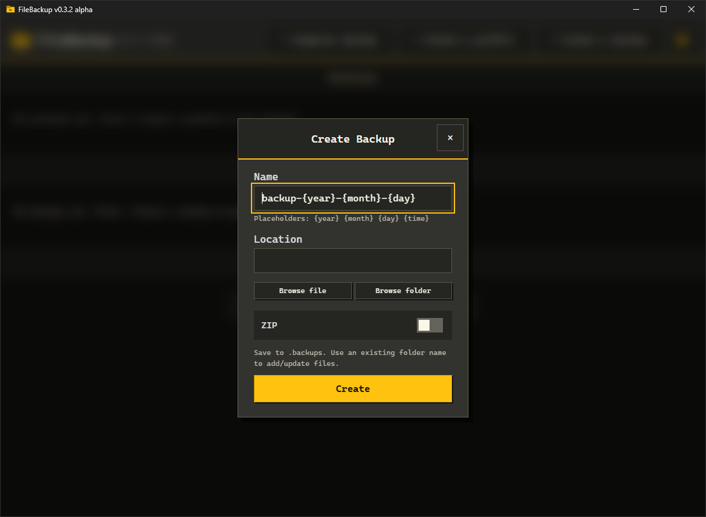

# File Backup v0.3.2-alpha

> This project is in alpha and is intended for testing and feedback. It is still in development, features may change, and bugs are expected.

A lightweight Windows EXE for backing up documents, files, and folders.

| Main menu | Settings |
| --- | --- |
|  |  |
| **Create profile** | **Create backup** |
|  |  |

## Features

- **Folder and ZIP backups:** Choose a file or folder, name your backup, and copy it or create a ZIP.
- **Profiles:** Save a source, name, and ZIP preference. Click a profile to run it; you can edit and/or delete it.
- **Backup management:** Click a backup card to open it in File Explorer. You can edit and/or delete it.
- **Multiple backups:** Run backups together with progress bars, file counts, and processed sizes. Conflicting destinations are locked.
- **Backup status:** Click a status card for details. X cancels active backup, and dismisses finished failed or canceled notifications.
- **Dismissal countdown:** Completed, cancelled, and failed statuses dismiss after **5 seconds** by default. Completion is green; cancellation and failure are red. Set the delay to **0** to keep them visible.
- **Settings:** Use the gear to configure storage paths, compression, exclusions, overwriting, retries, tray behavior, notifications, and status dismissal. ZIP and log compression default to **6**.
- **Date placeholders:** Names support `{year}`, `{month}`, `{day}`, `{hour}`, `{minute}`, `{second}`, and `{time}` (`HHmmss`). Generated backups include the dates; profile cards show the name without placeholders.
- **System tray:** Closing the window hides it to the tray by default, with an optional notification. Click the tray icon to reopen or choose **Exit** from its menu. Tray behavior is configurable.
- **Compressed logs:** Each run creates a timestamped `.log.gz` recording actions and exact setting changes with old/new values.
- **GitHub updates:** Newer full releases appear as an update card. Click it to open GitHub, or **Update** to verify, replace the EXE, and restart. Running backups block updating; your data and settings are preserved. Prereleases are skipped.
- **Popups:** Close with X, Escape, or an outside click.

Automatic backups are shown in the interface but are unavailable.

## Requirements

- 64-bit Windows with Robocopy and built-in curl.
- Microsoft Edge WebView2 Runtime.
- [7-Zip](https://www.7-zip.org/) for ZIP backups. FileBackup checks `PATH` and the usual installation locations.
- Write access to the application folder and your backup/log locations.

## Getting started

1. Download **filebackup.exe** from [Releases](https://github.com/godblessmerica/File-Backup/releases).
2. Place it in its own folder, such as `C:\Users\admin\FileBackup\`.
3. Run it. It creates `config.json`, `profiles.json`, `.backups`, `.logs`, and its `.webview` cache automatically.
4. Click **Create a backup** or **Create a profile** to begin.

Only the EXE is needed; no BAT, PowerShell manager, or source files are required.

## Developers

Install [Rust](https://www.rust-lang.org/tools/install) with the **x86_64-pc-windows-msvc** toolchain and Visual Studio Build Tools with **Desktop development with C++** and the **Windows SDK**. The runtime requirements above also apply.

Download or clone the source, then open PowerShell in the folder containing `Cargo.toml`:

```powershell
# Build and run from source
cargo run --release

# Build the EXE without launching it
cargo build --release

# Run the Rust checks
cargo test
```

The compiled EXE is at `target\release\filebackup-vX.X.X.exe`. The interface in `src/ui.html` and the icon assets are embedded during compilation; rebuild after changing them.

## Known limitations

Files locked by another application may fail to back up. Cancelling a folder backup leaves files already copied; cancelling a ZIP preserves the previous archive.

Please report bugs in [Issues](https://github.com/godblessmerica/File-Backup/issues).

## License

Distributed under the **GNU GPLv3 License**. See the `LICENSE` file in this repository for more information.
