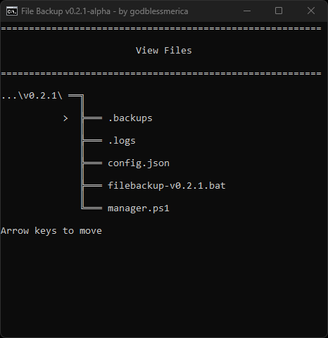
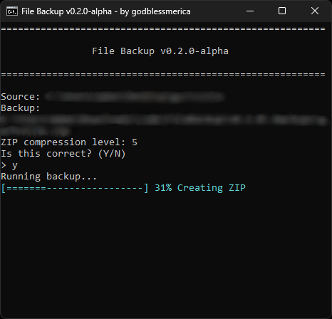
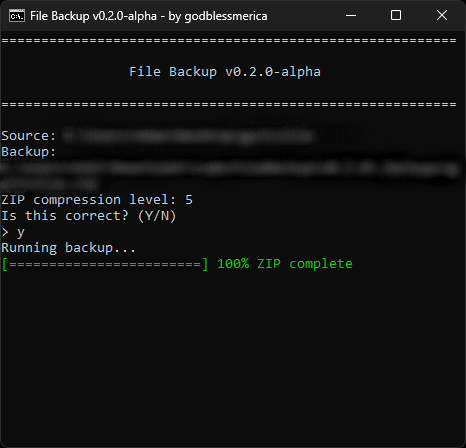

# File Backup
> This project is in alpha and is for testing and feedback it is not complete and may or may not change further. So expect bugs.

A lightweight .bat file for creating backups of important documents, folders, files and more!

| Main menu | **Browse files** |
| --- | --- |
|  |  |
| **Create ZIP backup** | **Backup complete** |
|  |  |


## Features

- Create folder backups or add files and folders to an existing backup.
- Create ZIP backups from a source or compress an existing backup folder.
- Rename and delete backup folders and ZIP archives.
- Navigate menus with arrow keys and a branching folder view.
- Show copy, compression, and archive verification progress.
- Record timestamped events in compressed per-run logs.
- Edit configuration directly from the application.
- Configure storage locations, exclusions, overwrite behavior, compression, and copy retries.

## Requirements

- Windows with Windows PowerShell 5.1 or later and Robocopy.
- 7-Zip for ZIP backups and compressed logs. The application checks `PATH` and the usual `Program Files\7-Zip` installation locations.
- Write access to the application directory and your configured backup/log locations.

## Getting started
1. Grab the .bat from the  [latest release](https://github.com/godblessmerica/File-Backup/releases/latest)
2. Put it in a separate folder
- Example: C:\Users\user\filebackup-v0.2.0\ (this is where your backups will be stored as well)
3. Run the .bat file and it will automatically create a backup and logs folder along with config and manager for the ui, zips, and logs.
4. Select a action with arrow keys

## Controls

| Key | Action |
| --- | --- |
| Up / Down | Move the highlighted selection |
| Right Arrow / Enter | Select a menu option |
| Left Arrow | Return to the previous question or menu |
| Any key on a completion screen | Return to the main menu |

Choose **Exit** from the main menu to close the application.
## Usage

- **Upload:** add to an existing backup or create a new one. New folders use the source name; single files ask for a destination folder name. Duplicate new names are rejected.
- **ZIP:** archive a source or an existing backup. Archives are verified, original folders remain, and existing ZIPs are protected from replacement.
- **Rename / Delete:** select a backup folder or ZIP. Deletion is permanent and requires typing `DELETE`.
- **View files:** browse folders or reveal files in File Explorer. Left Arrow goes up; at the root it returns to the menu. Paths start with `...\<application folder>\`; long headers use `║` below the path.

Progress appears below **Running backup…**. Copy progress is per file. Completed progress stays visible for two seconds by default, then any key returns to the menu.

## Configuration

Use **Edit config** or edit `config.json`, then restart the application.

| Settings | Purpose |
| --- | --- |
| `BackupRoot`, `LogDirectory` | Storage paths; default `.backups` and `.logs` |
| `CompressionLevel`, `LogCompressionLevel` | ZIP and gzip levels: `0`, `1`, `3`, `5`, `6`,  `7`, `9`; default `6` |
| `ExcludeFiles`, `ExcludeFolders` | Exclusion patterns, such as `*.tmp` or `cache` |
| `OverwriteExistingFiles` | Update existing files (`true`) or only add missing files (`false`) |
| `CopyRetries`, `RetryDelaySeconds` | Copy retries and delay; defaults `3` and `5` seconds |
| `CompletionDelaySeconds` | Completed progress delay; default `2` seconds |
| `DateFormat` | Log filename format; default `{year}-{month}-{day}_{hour}-{minute}-{second}` |

Paths can be relative to the application directory or absolute. Escape backslashes in JSON, for example `"D:\\Backups"`. Enter exclusions as comma-separated patterns in the editor; blank clears the list.

Date placeholders: `{year}`, `{month}`, `{day}`, `{hour}`, `{minute}`, `{second}`, and `{time}` (`HHmmss`). Use filename-safe separators; Windows filenames cannot contain `:`. Backup names do not receive timestamps.

## Logs and troubleshooting

Each run records timestamped events in `.logs`. Successful saves leave only `.log.gz`; a plain `.log` may appear while writing or remain if compression fails. Open compressed logs with 7-Zip.

For failures, check the session log. For duplicate names, add to the existing backup or rename/delete it. Keep backup and log locations outside the source folder. Restart after changing settings.

## Command-line copying

```powershell
powershell.exe -NoProfile -ExecutionPolicy Bypass -File .\manager.ps1 -NonInteractive -Source "C:\Data\Project"
```

Add `-ExistingBackupName "Project"` to update an existing backup. `-BackupRoot` and `-LogDirectory` override configured paths. ZIP and management actions use the menu.

Scheduled backups are not included in this version.


## Known Bugs

- If file you want to backup is currently being used in another application the batch file will run into a error
- This project is in alpha there is probably many bugs I'm unaware about please report them in [Issues](https://github.com/godblessmerica/File-Backup/issues)

## License

Distributed under the **GNU GPLv3 License**. See the `LICENSE` file in this repository for more information.
